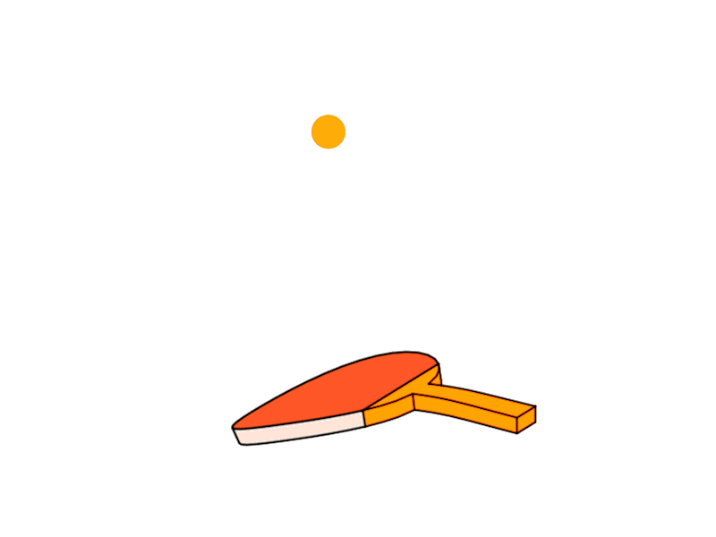
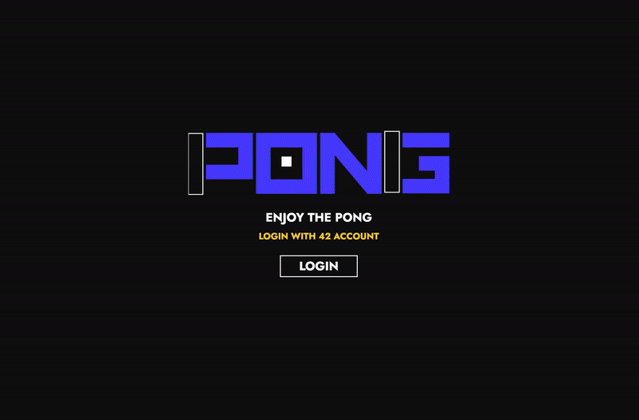

<div align="center">
<a href="https://github.com/hadi14250">
    
  </a>
  <h3 align="center">Transcendence</h3>
  The capstone project of the 42 Abu Dhabi common core
  <br>
  <br>
</div>

<div align="center">
<a href="https://github.com/hadi14250">
    
  </a>


</div>

<br>


# Transcendence

Transcendence is the closing project of the 42 common core. The brief was to bring back the classic 1970s Pong experience, but under tight technical limitations: no modern frameworks or libraries were allowed. To meet that challenge, we built the frontend in vanilla JavaScript and powered the backend with Python and Django.

<br>

## What Makes It Stand Out

Since front-end frameworks were off-limits, we engineered our own from scratch, taking cues from React's component model. We call it **`The Onion Framework`**.

<br>

## Tech Stack


<br>
<br>

## Getting Started

- Make sure Docker is running
- Spin everything up with ```docker-compose up --build```
- Open ```https://localhost:80/``` in your browser
- Sign in through 42 Intra
- Have fun


## Contributers

<table>

<tr>
    <td align="center" style="word-wrap: break-word; width: 150.0; height: 150.0">
        <a href=https://github.com/hadi14250>
            
            <br />
            <sub style="font-size:14px"><b>Hadi Kaddoura</b></sub>
        </a>
    </td>
    <td align="center" style="word-wrap: break-word; width: 150.0; height: 150.0">
        <a href=https://github.com/Onesignature>
            
            <br />
            <sub style="font-size:14px"><b>Bilal Saeed</b></sub>
        </a>
    </td>
		<td align="center" style="word-wrap: break-word; width: 150.0; height: 150.0">
        <a href=https://github.com/muhammadganiev>
            
            <br />
            <sub style="font-size:14px"><b>MukhammadOthman</b></sub>
        </a>
    </td>
    <td align="center" style="word-wrap: break-word; width: 150.0; height: 150.0">
        <a href=https://github.com/Faraz7704>
            
            <br />
            <sub style="font-size:14px"><b>Faraz Khan</b></sub>
        </a>
    </td>
	<td align="center" style="word-wrap: break-word; width: 150.0; height: 150.0">
        <a href=https://github.com/https://github.com/germanos21>
            
            <br />
            <sub style="font-size:14px"><b>Germanous</b></sub>
        </a>
    </td>
</tr>
</table>

